# ClearPass Policy Visualiser

Visualise, analyse and troubleshoot Aruba ClearPass Services, Role Mapping Policies, Enforcement Policies and Enforcement Profiles.

<p align="center">
  
  
  
  
</p>

---

## Overview

ClearPass Policy Visualiser is a Flask-based visualisation and analysis platform for Aruba ClearPass Policy Manager.

It provides graphical visibility into the complete authentication and authorisation workflow, including:

- Services
- Authentication Sources
- Authorisation Sources
- Role Mapping Policies
- Role Mapping Rules
- Enforcement Policies
- Enforcement Profiles
- Enforcement Attributes
- Roles
- Endpoint Repository conditions

The Visualiser consolidates policy relationships, dependencies and enforcement actions into an interactive interface, allowing administrators to understand ClearPass configuration without navigating multiple areas of Policy Manager.

Additional capabilities include:

- Dependency analysis across ClearPass policy objects
- Unused object detection
- Enforcement Profile inspection
- Role Mapping and Enforcement Policy graph visualisation
- Endpoint Repository analysis
- Endpoint profiling visibility
- RADIUS-based user authentication
- Role-based application access
- Browser-based Initial Setup
- Configuration and connectivity validation
- Optional API-assisted ClearPass configuration
- Read-only ClearPass change review before provisioning
- Idempotent creation and validation of required ClearPass objects
- Optional PostgreSQL endpoint profiling acceleration

The application uses ClearPass REST APIs secured with OAuth 2.0 Client Credentials Grant for policy retrieval, analysis and optional configuration.

Users authenticate against ClearPass using RADIUS, with application permissions derived from returned role attributes such as `Aruba-User-Role`.

Endpoint profiling data can optionally be loaded from the ClearPass PostgreSQL database using the built-in `appexternal` account and the `tips_endpoint_profiles` table.

In the reference environment, PostgreSQL reduced endpoint fingerprint cache loading from approximately 74 seconds using the REST API to approximately 0.08 seconds.

<p align="center">
  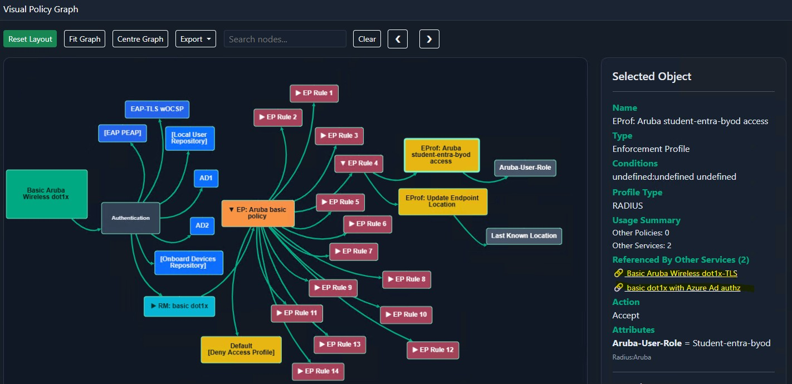
</p>

---

## Screenshots

### Setup Validation

Before configuration is saved, the Visualiser validates connectivity to the configured services.

<p align="center">
  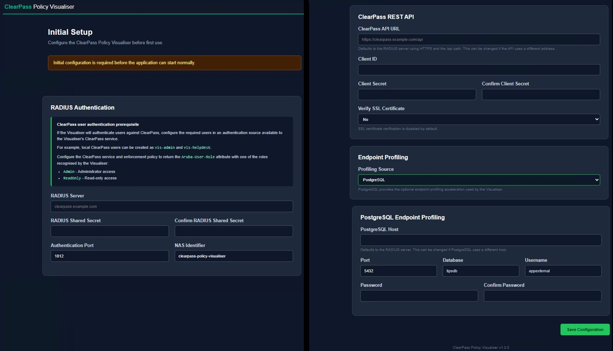
</p>

<p align="center">
  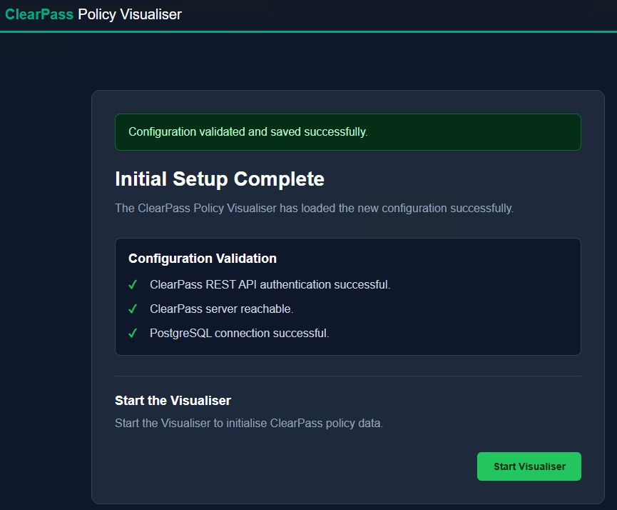
</p>

### API-Assisted ClearPass Configuration

Initial Setup can inspect, create and verify the ClearPass objects required for Policy Visualiser.

<p align="center">
  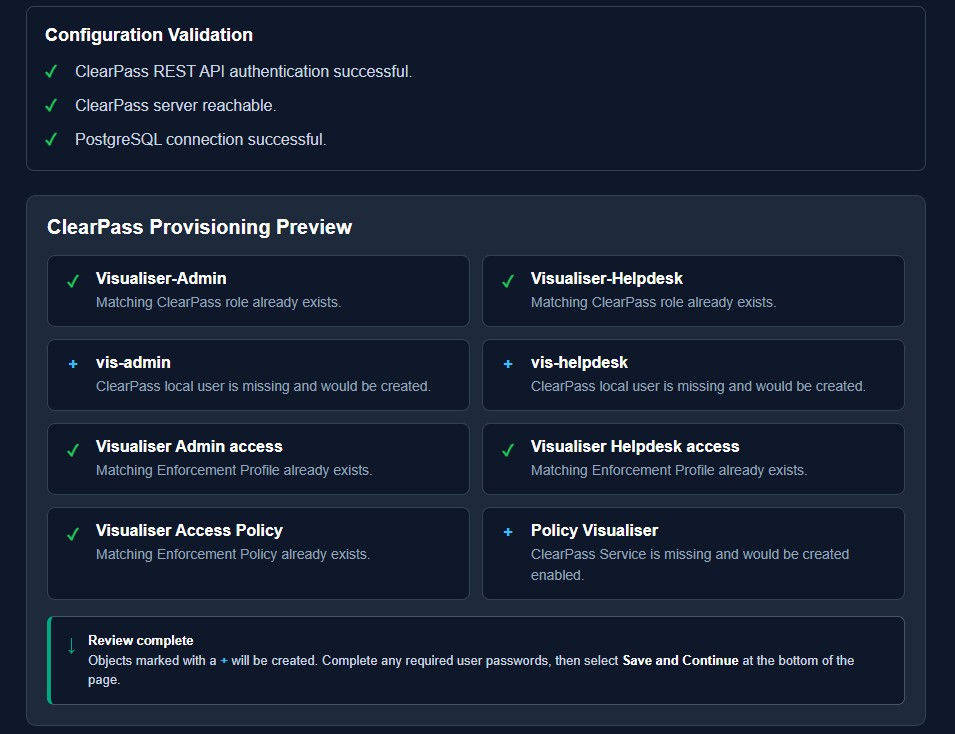
</p>

### Setup Complete Provisioning Summary

Setup Complete reports which ClearPass objects were created and which existing objects were validated and left unchanged.

<p align="center">
  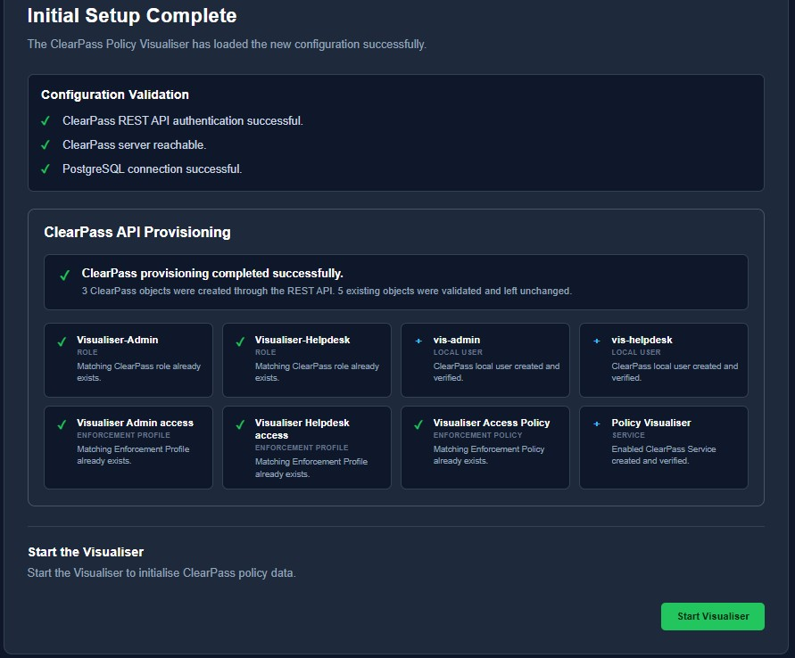
</p>

### App Startup

<p align="center">
  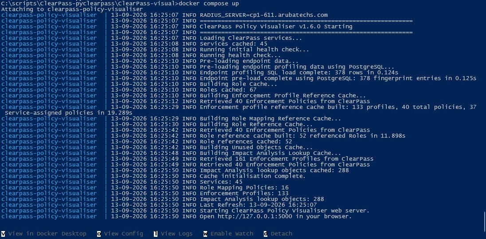
</p>

### Login Page

<p align="center">
  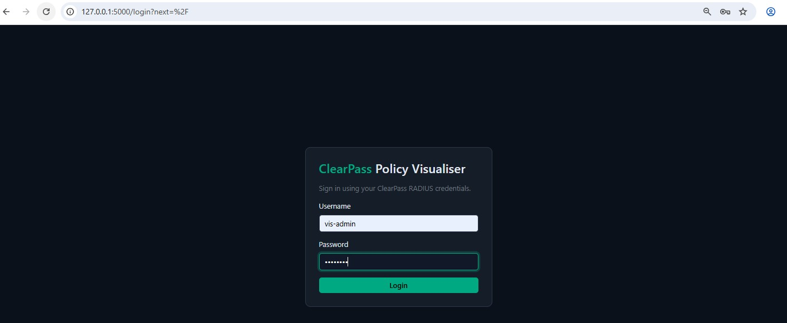
</p>

### Dashboard

<p align="center">
  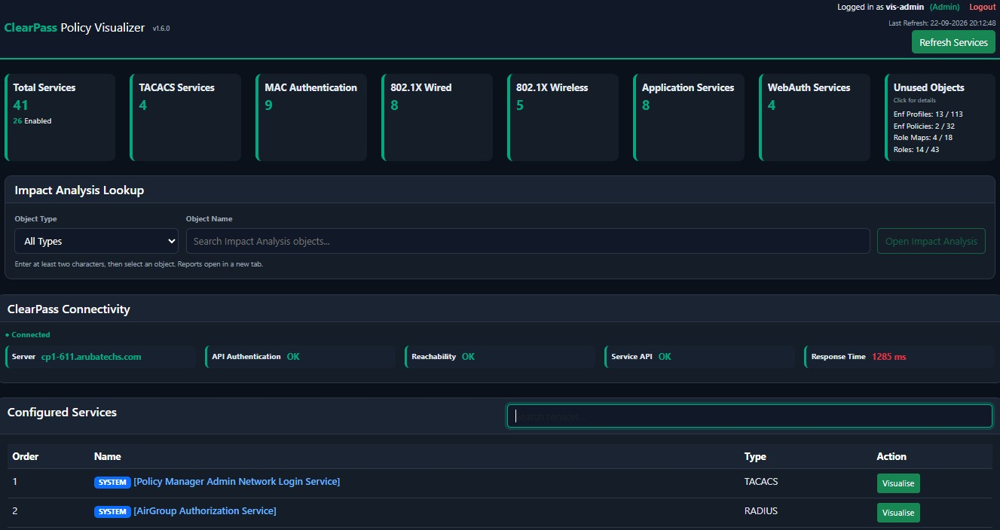
</p>

### Service Dependency Graph

<p align="center">
  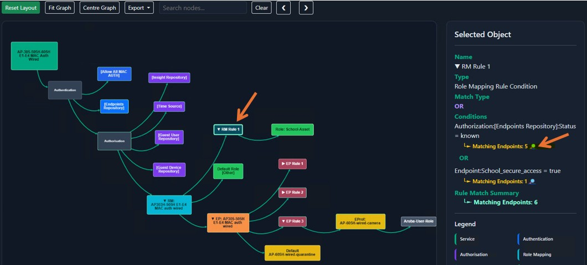
</p>

<p align="center">
  
</p>

### Repository Search

<p align="center">
  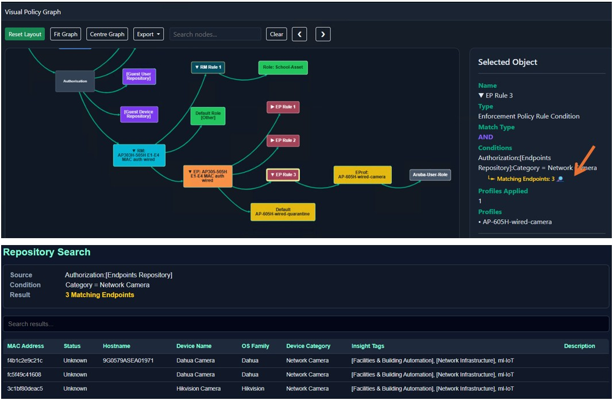
</p>

### Endpoint Details

<p align="center">
  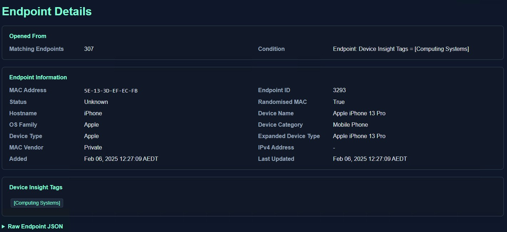
</p>

### Unused Objects

<p align="center">
  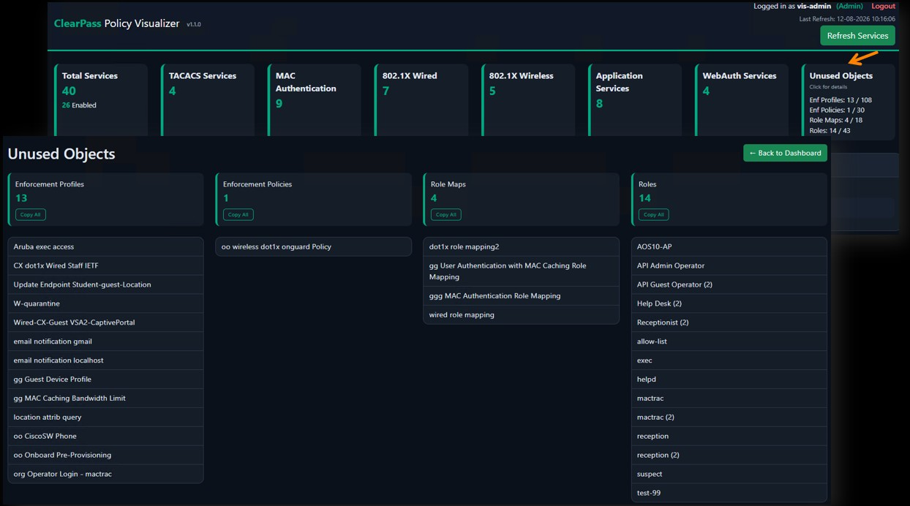
</p>

---

## Features

### First-Run Initial Setup

ClearPass Policy Visualiser includes a browser-based Initial Setup workflow for configuring, validating and optionally provisioning the ClearPass integration.

When the application is started without an existing Visualiser configuration, Flask starts without initialising the ClearPass caches and redirects the administrator to Initial Setup.

The setup workflow configures:

- ClearPass REST API
- ClearPass REST API SSL certificate verification
- RADIUS authentication
- RADIUS shared secret
- NAS Identifier
- Endpoint profiling source
- Optional ClearPass PostgreSQL endpoint profiling
- Optional API-assisted ClearPass configuration

Sensitive fields require confirmation before validation. Configuration is validated before being persisted.

### Setup Connectivity Validation

Initial Setup performs connectivity validation before configuration is saved.

Validation includes:

- ClearPass server connectivity
- ClearPass REST API authentication
- PostgreSQL connectivity when PostgreSQL endpoint profiling is selected

If the ClearPass server cannot be reached, the REST API authentication test is skipped rather than incorrectly reported as an authentication failure.

Validation results are displayed individually so administrators can distinguish between successful, failed and skipped tests. Failed setup attempts remain on the Initial Setup page and do not create a completed Visualiser configuration.

### API-Assisted ClearPass Configuration

ClearPass Policy Visualiser v1.3.0 adds an optional API-assisted configuration workflow to Initial Setup.

When **Automatically configure ClearPass for Policy Visualiser** is enabled, the Visualiser can create or validate the complete ClearPass authentication dependency chain:

1. `Visualiser-Admin` role
2. `Visualiser-Helpdesk` role
3. `visadmin` Local User
4. `vis-helpdesk` Local User
5. `Visualiser Admin access` Enforcement Profile
6. `Visualiser Helpdesk access` Enforcement Profile
7. `Visualiser Access Policy`
8. `Policy Visualiser` RADIUS Service

The provisioned Enforcement Profiles return:

```text
Aruba-User-Role = Admin
Aruba-User-Role = ReadOnly
```

The provisioned Enforcement Policy maps:

```text
Visualiser-Admin
        ↓
Visualiser Admin access
        ↓
Aruba-User-Role = Admin
```

and:

```text
Visualiser-Helpdesk
        ↓
Visualiser Helpdesk access
        ↓
Aruba-User-Role = ReadOnly
```

The provisioned RADIUS Service uses:

- `802.1X Wired` service template
- PAP authentication
- `[Local User Repository]`
- `MATCHES_ALL` service rules
- The configured Visualiser usernames
- The NAS Identifier entered during Initial Setup
- `Visualiser Access Policy`
- Enabled service state

The NAS Identifier is mandatory for assisted configuration. The value configured in the Visualiser must exactly match the NAS Identifier condition in the ClearPass Service.

#### ClearPass Change Review

The read-only **Review ClearPass Changes** operation reports each object as:

- `existing` - the object exists and matches the required configuration
- `would_create` - the object is missing and will be created
- `conflict` - the object exists but does not match the required configuration

Review uses an AJAX request, so entered secrets remain in the browser form. No ClearPass configuration changes are made during review.

When automatic configuration is enabled, a successful review is required before **Save and Continue** becomes available. Changing a relevant setup field invalidates the previous review.

#### Safety and Idempotence

The assisted configuration workflow is designed to preserve existing ClearPass configuration.

- Existing matching objects are validated and left unchanged.
- Existing Local User passwords are not reset.
- Passwords are required only when a Local User needs to be created.
- Local User passwords are not saved in `.visualiser.env`.
- Existing conflicting objects are not replaced or updated automatically.
- Missing objects are created in dependency order.
- Created objects are retrieved and verified after creation.
- Repeated provisioning is idempotent.
- Setup Complete reports which objects were created and which already existed.
- API-assisted configuration never deletes existing ClearPass objects.

### Configuration Management

Visualiser configuration created by Initial Setup is stored locally in:

```text
.visualiser.env
```

The application explicitly loads this file during startup. The legacy `config.yaml` configuration path has been removed, and the application no longer performs implicit loading of a conventional `.env` file.

```text
Fresh Installation
        │
        ▼
Initial Setup
        │
        ├── Configuration Validation
        ├── Optional ClearPass Change Review
        └── Optional API-Assisted Provisioning
        │
        ▼
.visualiser.env
        │
        ▼
Setup Complete
        │
        ▼
Start Visualiser
        │
        ▼
Login
```

The `.visualiser.env` file contains sensitive configuration and is excluded from Git.

### Service Visualisation

Visualise complete ClearPass service flows including:

- Authentication Sources
- Authorisation Sources
- Role Mapping Policies
- Role Mapping Rules
- Enforcement Policies
- Enforcement Profiles

### Interactive Policy Graph

Interactive graph features include:

- Zoom and pan
- Fit graph
- Centre graph
- Reset layout
- Node search
- Previous / Next search navigation
- PNG export
- JPG export

Unused Enforcement Policies and Role Mapping Policies can also be opened directly from the Unused Objects view and displayed using the policy graph.

### Repository Search

Directly analyse Endpoint Repository conditions referenced by Role Mapping Rules.

Features include:

- Matching endpoint counts
- Repository search
- Endpoint drill-down navigation
- Rule condition analysis

### Endpoint Profiling

Endpoint profiling can display:

- Hostname
- Device Category
- Device Family
- Device Name
- Device Type
- Expanded Device Type
- MAC Vendor
- IPv4 Address

Endpoint profiling can use either the ClearPass REST API or optional direct PostgreSQL access for accelerated cache loading.

### Enforcement Profile Analysis

Provides detailed visibility into Enforcement Profile configuration and dependencies, including profile metadata, enforcement attributes and dependent policies and services.

### Role Mapping Analysis

Provides visibility into:

- Role Mapping Rules
- Rule Conditions
- Repository usage
- Endpoint matches
- Assigned roles

### Unused Object Analysis

Identifies ClearPass configuration objects that are no longer referenced, based on dependency analysis rather than name matching.

Detects unused:

- Enforcement Profiles, including default enforcement profiles
- Enforcement Policies
- Role Mapping Policies
- Roles

Role usage is resolved across Role Mapping Policies, assigned roles, default roles, `Tips:Role` conditions, Enforcement Policies and Guest Operator Profiles through the built-in `[Guest Roles]` mapping.

ClearPass built-in objects named with square brackets are automatically excluded. Each unused-object category provides a one-click **Copy All** option.

---

## Architecture

```text
Browser
    │
    ▼
Flask Web Application
    │
    ├── Initial Setup
    │       ├── Configuration Validation
    │       ├── ClearPass Change Review
    │       ├── Optional API-Assisted Provisioning
    │       │       ├── Roles
    │       │       ├── Local Users
    │       │       ├── Enforcement Profiles
    │       │       ├── Enforcement Policy
    │       │       └── RADIUS Service
    │       └── .visualiser.env
    │
    ├── Authentication
    │       └── ClearPass RADIUS
    │
    ├── Policy Visualisation
    ├── Dependency Analysis
    ├── Unused Object Analysis
    │
    ├── ClearPass REST APIs
    │       ├── Services
    │       ├── Authentication Sources
    │       ├── Authorisation Sources
    │       ├── Role Mapping Policies
    │       ├── Enforcement Policies
    │       ├── Enforcement Profiles
    │       ├── Roles
    │       ├── Local Users
    │       ├── Operator Profiles
    │       └── Endpoint Repository
    │
    └── PostgreSQL (Optional)
            └── Endpoint Profiling Cache
```

---

## Authentication and Data Sources

### ClearPass REST APIs

Service, Role Mapping, Enforcement Policy and Enforcement Profile data is retrieved using the ClearPass REST APIs.

When API-assisted configuration is enabled, the same integration is also used to inspect, create and verify the roles, Local Users, Enforcement Profiles, Enforcement Policy and RADIUS Service required by Policy Visualiser.

API authentication uses OAuth 2.0 Client Credentials Grant:

```text
grant_type=client_credentials
```

The API client requires permissions appropriate to the data retrieval and optional configuration operations used by the Visualiser, including:

- Services
- Service configuration
- Authentication Sources
- Authorisation Sources
- Role Mapping Policies
- Enforcement Policies
- Enforcement Profiles
- Roles
- Local Users
- Guest Operator Profiles
- Endpoint Repository data

The ClearPass API client can be found or created under:

```text
Home › Administration › API Services › API Clients
```

### User Authentication

Users authenticate against ClearPass using RADIUS PAP authentication. The application supports role-based access using reply attributes including:

```text
Aruba-User-Role
Filter-Id
Class
```

| Aruba-User-Role | Application Role |
|-----------------|------------------|
| Admin | Administrator |
| ReadOnly | Read Only |

The required RADIUS server, port, shared secret and NAS Identifier are configured through Initial Setup.

### PostgreSQL Endpoint Profiling Acceleration

Endpoint profiling information can optionally be loaded directly from the ClearPass PostgreSQL database using the built-in read-only account:

```text
appexternal
```

The Visualiser queries:

```text
tips_endpoint_profiles
```

The `appexternal` password is configured in ClearPass under:

```text
Administration › Server Manager › Server Configuration
› Cluster-Wide Parameters › Database
```

Use the External PostgreSQL Password configured on the Database tab.

#### REST API Mode

REST API mode is the default and does not require direct database connectivity.

```text
Endpoint Profiling Source: REST API
```

#### PostgreSQL Mode

PostgreSQL is recommended for faster endpoint profiling when the `appexternal` account is available.

```text
Endpoint Profiling Source: PostgreSQL
```

When PostgreSQL mode is selected, Initial Setup requests the host, port, database, username, password and password confirmation. The connection is validated before setup can complete.

### Data Source Summary

| Function | Data Source | Authentication |
|----------|-------------|----------------|
| User Login | ClearPass RADIUS | PAP |
| Service Discovery | ClearPass REST API | OAuth 2.0 Client Credentials |
| Authentication Sources | ClearPass REST API | OAuth 2.0 Client Credentials |
| Authorisation Sources | ClearPass REST API | OAuth 2.0 Client Credentials |
| Role Mapping Policies | ClearPass REST API | OAuth 2.0 Client Credentials |
| Enforcement Policies | ClearPass REST API | OAuth 2.0 Client Credentials |
| Enforcement Profiles | ClearPass REST API | OAuth 2.0 Client Credentials |
| Roles | ClearPass REST API | OAuth 2.0 Client Credentials |
| Local Users | ClearPass REST API | OAuth 2.0 Client Credentials |
| Guest Operator Profiles | ClearPass REST API | OAuth 2.0 Client Credentials |
| Endpoint Repository | ClearPass REST API | OAuth 2.0 Client Credentials |
| Endpoint Profiling Cache | REST API or PostgreSQL | OAuth 2.0 / `appexternal` |

---

## Project Structure

```text
clearpass-policy-visualiser
│
├── app.py
├── version.py
├── requirements.txt
│
├── cp_cache.py
├── cp_client.py
├── cp_endpoint.py
├── cp_endpoint_sql.py
├── cp_enforcement.py
├── cp_graph.py
├── cp_health.py
├── cp_object_graph.py
├── cp_provision.py
├── cp_role_mapping.py
├── cp_services.py
├── cp_setup.py
├── cp_unused_objects.py
│
├── auth/
│
├── sql/
│   └── endpoint_profiles.sql
│
├── templates/
│   ├── endpoint_details.html
│   ├── enforcement_profile_detail.html
│   ├── index.html
│   ├── login.html
│   ├── object_detail.html
│   ├── repository_search.html
│   ├── service.html
│   ├── setup.html
│   ├── setup_complete.html
│   └── unused_objects.html
│
├── static/
│   └── service_graph.js
│
├── screenshots/
│
└── README.md
```

---

## Python Dependencies

```text
Flask>=3.0.3
Flask-Login>=0.6.3
Flask-Limiter>=3.8.0
python-dotenv>=1.0.1
psycopg[binary]>=3.2.0
pyclearpass>=1.0.8
```

PyYAML is not a direct production dependency because the legacy YAML configuration path has been removed.

---

## Requirements

- Python 3.11 or later
- Aruba ClearPass Policy Manager
- ClearPass REST API Client using OAuth 2.0 Client Credentials Grant
- A ClearPass API Client with sufficient permissions to inspect and optionally create the required Policy Visualiser objects
- Network connectivity from the Visualiser host to ClearPass
- RADIUS configuration in ClearPass for Visualiser user authentication
- PostgreSQL access using the built-in `appexternal` account only when PostgreSQL endpoint profiling is selected

---

## Installation

```bash
git clone <REPOSITORY-URL>
cd clearpass-policy-visualiser
python -m venv venv
```

### Windows

```bash
venv\Scripts\activate
```

### Linux

```bash
source venv/bin/activate
```

Install dependencies and start the application:

```bash
python -m pip install -r requirements.txt
python app.py
```

On a new installation, the application starts without initialising ClearPass caches and presents the Initial Setup page.

---

## Initial Setup

The Initial Setup wizard replaces the previous manual `.env` or `config.yaml` process.

### RADIUS Authentication

Configure:

- RADIUS Server
- RADIUS Port
- RADIUS Shared Secret
- Confirm RADIUS Shared Secret
- NAS Identifier

### ClearPass REST API

Configure:

- ClearPass API URL
- Client ID
- Client Secret
- Confirm Client Secret
- SSL certificate verification preference

The API client can be found or created under:

```text
Home › Administration › API Services › API Clients
```

### Endpoint Profiling

Select:

- REST API
- PostgreSQL - recommended for faster profiling

REST API is the default and does not require direct database connectivity. When PostgreSQL is selected, configure the PostgreSQL host, port, database, username and password.

### Assisted Configuration Flow

```text
Enable Automatic ClearPass Configuration
        │
        ▼
Enter Visualiser Usernames and Required Passwords
        │
        ▼
Review ClearPass Changes
        │
        ├── Existing
        ├── Would Create
        └── Conflict
        │
        ▼
Save and Continue
        │
        ▼
Run Fresh Server-Side Validation
        │
        ▼
Create Missing ClearPass Objects
        │
        ▼
Verify Provisioned Objects
        │
        ▼
Save .visualiser.env
        │
        ▼
Setup Complete
```

If automatic configuration is not selected, Initial Setup follows the manual ClearPass configuration path and does not create or modify ClearPass objects.

---

## Configuration Files and Secrets

### `.visualiser.env`

Initial Setup creates `.visualiser.env`, which contains active Visualiser configuration and may include:

- ClearPass API Client Secret
- RADIUS Shared Secret
- PostgreSQL password

Do not commit this file to source control. The supplied `.gitignore` excludes it.

ClearPass Local User passwords entered for API-assisted configuration are used only when creating missing users. These passwords are not written to:

- `.visualiser.env`
- the Flask session
- rendered HTML
- provisioning result data
- application logs

Existing matching Local Users are preserved and their passwords are not reset.

### `.flask_secret`

If `FLASK_SECRET_KEY` is not explicitly configured, the application generates a persistent Flask session secret and stores it in `.flask_secret`. This file is excluded from Git.

### Correcting Saved Credentials

To correct connection credentials after Initial Setup:

1. Stop Policy Visualiser.
2. Edit `.visualiser.env`.
3. Update the affected value.
4. Ensure the value matches the corresponding ClearPass configuration.
5. Restart Policy Visualiser.

Common values include:

```text
CLEARPASS_CLIENT_SECRET
RADIUS_SECRET
SQL_PASSWORD
```

A restart is required because the Visualiser loads `.visualiser.env` during application startup.

If the RADIUS secret is changed, the value must match the shared secret configured for the Visualiser RADIUS client in ClearPass. If the API Client Secret is changed, the value must match the corresponding ClearPass API Client.

---

## Starting the Visualiser

For an existing configured installation:

```bash
python app.py
```

Startup includes:

- ClearPass service discovery
- ClearPass health check
- Endpoint profiling cache
- Role cache
- Enforcement Profile reference cache
- Role Mapping reference cache
- Unused Object cache

The Setup Complete page displays an animated loading overlay while the initial cache is being built.

---

## Refreshing Cached Data

The dashboard provides a cache refresh operation which rebuilds Visualiser data from ClearPass, including health, services, roles, Enforcement Profile references, Role Mapping references and Unused Object analysis.

---

## PostgreSQL Endpoint Profiling Performance

### Reference Results

| Method | Time |
|--------|------|
| REST API | ~74 seconds |
| PostgreSQL | ~0.08 seconds |

Reference environment:

```text
Endpoint Profiles: 376
```

These figures are observations from the reference environment and are not guaranteed in other deployments.

---

## Typical Use Cases

- Troubleshooting authentication failures
- Change impact analysis
- ClearPass documentation
- Configuration reviews
- Configuration cleanup
- Endpoint repository and profiling analysis
- Operational knowledge transfer

---

## Roadmap

Planned enhancements include:

- Administrator-only connection configuration page
- Secure validation and update of saved ClearPass, RADIUS and PostgreSQL connection settings
- Enhanced role-based authorisation controls
- Impact analysis reporting
- SVG graph export
- Standalone packaged release
- Multi-server ClearPass support

---

## Changelog

### v1.3.0

#### API-Assisted ClearPass Configuration

- Added optional automatic ClearPass configuration during Initial Setup
- Added creation and validation of `Visualiser-Admin` and `Visualiser-Helpdesk` roles
- Added creation and validation of Administrator and Helpdesk Local Users
- Added creation and validation of Admin and ReadOnly Enforcement Profiles
- Added creation and validation of `Visualiser Access Policy`
- Added creation and validation of the enabled `Policy Visualiser` RADIUS Service
- Added mandatory NAS Identifier validation
- Added PAP and Local User Repository configuration
- Added exact mapping of Visualiser roles to `Aruba-User-Role` values

#### ClearPass Change Review

- Added read-only **Review ClearPass Changes** workflow
- Added `existing`, `would_create` and `conflict` states
- Added eight-object provisioning preview
- Added AJAX preview without clearing entered secrets
- Added automatic scrolling to results and validation errors
- Added password validation for missing Local Users
- Added review invalidation when relevant values change
- Added successful-review requirement before Save and Continue

#### Provisioning Safety

- Added idempotent provisioning
- Added preservation of existing matching objects and Local User passwords
- Added conflict detection without automatic replacement
- Added read-after-create verification
- Added dependency-order provisioning
- Prevented Local User passwords from being written to `.visualiser.env`
- Added mixed existing and newly created object support

#### Initial Setup User Interface

- Added automatic ClearPass configuration controls
- Added two-column provisioning preview
- Added clear next-step guidance after review
- Added API Client and `appexternal` location guidance
- Added PostgreSQL recommendation for faster profiling
- Added Setup Complete provisioning summary and object counts
- Added responsive four-column provisioning results
- Added animated Start Visualiser loading overlay
- Added reduced-motion-compatible loading animation

#### Testing

- Validated fresh, mixed and existing ClearPass configurations
- Validated repeated idempotent provisioning
- Validated Administrator and Helpdesk RADIUS authentication
- Validated `Admin` and `ReadOnly` application role assignment

### v1.2.0

- Added browser-based Initial Setup and Setup Complete workflow
- Added ClearPass, RADIUS and optional PostgreSQL configuration
- Added connectivity validation and secure `.visualiser.env` management
- Removed legacy `config.yaml` and implicit `.env` loading
- Added secure Flask session secret generation

### v1.1.1

- Added clickable unused Enforcement Profiles and dedicated detail view
- Added Enforcement Profile metadata and Enforcement Attribute visibility
- Improved layout and navigation consistency

### v1.1.0

- Added Unused Object analysis for profiles, policies, Role Mapping Policies and roles
- Added dependency analysis and Copy All workflows
- Added startup and refresh caching

### v1.0.0

- Initial public release

---

## Security Considerations

The Visualiser handles credentials used to communicate with ClearPass and, when enabled, PostgreSQL.

Files containing local secrets are excluded from Git, including:

```text
.visualiser.env
.flask_secret
cert.pem
key.pem
```

Administrators should:

- Protect access to the Visualiser host
- Use an appropriately scoped ClearPass API Client
- Protect RADIUS and PostgreSQL credentials
- Use appropriate TLS and certificate verification settings
- Use the read-only ClearPass change review before assisted configuration
- Confirm any object reported as a conflict
- Rotate credentials according to local security policy
- Restart the Visualiser after manually changing `.visualiser.env`
- Never commit `.visualiser.env` or `.flask_secret`

API-assisted configuration never deletes existing ClearPass objects and never automatically replaces conflicting objects.

---

## License

MIT License

---

## Disclaimer

This project is an independent community tool. It is not affiliated with, endorsed by, or supported by Hewlett Packard Enterprise (HPE).

Always validate configuration changes before applying them to production environments. Unused Object results should be treated as analysis and review candidates.

---

## Acknowledgements

- Aruba ClearPass
- HPE Aruba Networking
- Flask
- Cytoscape.js
- pyclearpass

---

**ClearPass Policy Visualiser v1.3.0**

Visualise. Analyse. Troubleshoot.
